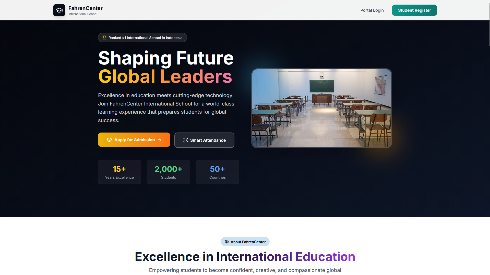
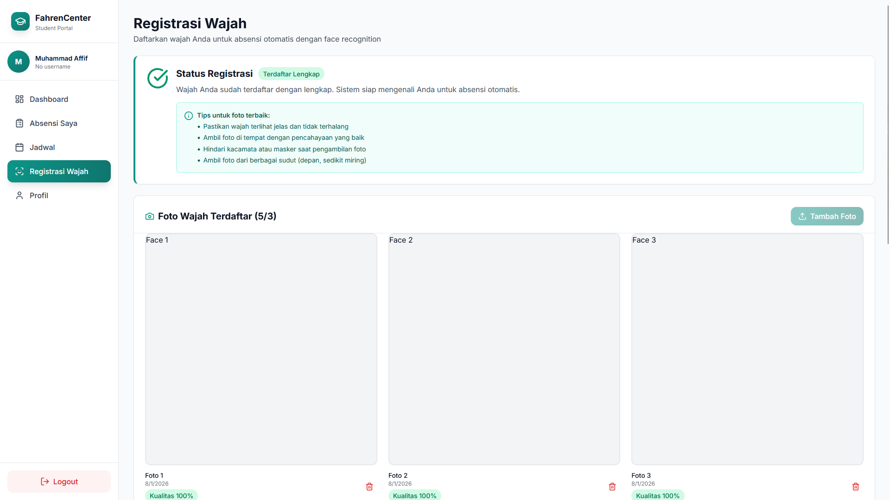
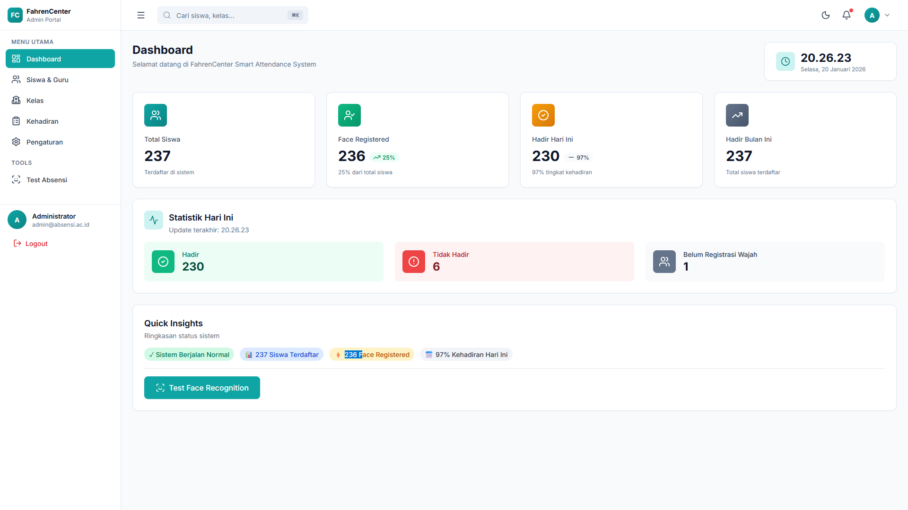
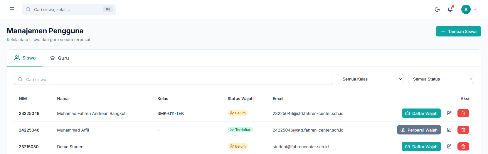

<div align="center">

# 🎓 FahrenCenter - Smart Attendance System

### *Sistem Absensi Berbasis Face Recognition dengan Liveness Detection*

[](https://www.python.org/)
[](https://react.dev/)
[](https://www.typescriptlang.org/)
[](https://fastapi.tiangolo.com/)
[](LICENSE)

**Production-Ready • Face Recognition • Liveness Detection • Modern UI/UX**

[📖 Documentation](#-documentation) • [🚀 Quick Start](#-quick-start) • [✨ Features](#-features) • [🎯 Demo](#-demo) • [🤝 Contributing](CONTRIBUTING.md)

---

</div>

## 📋 Table of Contents

- [Tentang Proyek](#-tentang-proyek)
- [Fitur Utama](#-fitur-utama)
- [Tech Stack](#-tech-stack)
- [Quick Start](#-quick-start)
- [Documentation](#-documentation)
- [Screenshots](#-screenshots)
- [Architecture](#-architecture)
- [Academic Context](#-academic-context)
- [Contributing](#-contributing)
- [License](#-license)

---

## 📖 Tentang Proyek

**FahrenCenter** adalah sistem absensi sekolah modern berbasis **face recognition** dan **liveness detection**. Sistem ini dirancang untuk menggantikan absensi manual tradisional dengan teknologi computer vision yang akurat, aman, dan user-friendly.

### 🎯 Tujuan

- ✅ **Akurasi Tinggi** - Face recognition dengan confidence > 90%
- ✅ **Anti-Spoofing** - Liveness detection mencegah photo/video fraud
- ✅ **User-Friendly** - Interface modern, intuitif, dan responsive
- ✅ **Production-Ready** - Siap deploy untuk sekolah swasta modern
- ✅ **Maintainable** - Clean architecture, well-documented, type-safe

### 🏫 Target Pengguna

- **Siswa** - Self-service attendance dengan face recognition
- **Guru** - Kiosk mode untuk absensi cepat di kelas
- **Admin** - Dashboard management, analytics, dan reporting

### 🎓 Konteks Akademik

Proyek ini dikembangkan sebagai bagian dari **Ujian Akhir Semester (UAS)** mata kuliah **Pengolahan Citra Digital (PCD)** di **Universitas Harkat Negeri**, Semester 5 (2025/2026).

**Learning Outcomes:**
- Implementasi algoritma Computer Vision (HOG, FaceNet, EAR)
- Image processing techniques (blur detection, brightness check)
- Full-stack development (React + FastAPI)
- Production deployment & security

---

## ✨ Fitur Utama

<table>
<tr>
<td width="50%">

### 🎭 Face Recognition
- **Detection:** HOG algorithm (~50ms)
- **Encoding:** FaceNet 128D vectors
- **Matching:** Euclidean distance (L2)
- **Accuracy:** 90-95% (lighting-dependent)
- **Multi-Encoding:** 3-5 photos per user

</td>
<td width="50%">

### 👁️ Liveness Detection
- **Blink Detection:** Eye Aspect Ratio (EAR)
- **Landmarks:** MediaPipe Face Mesh (468 points)
- **Anti-Spoofing:** Deteksi photo/video replay
- **Real-time:** 30 FPS processing
- **Effectiveness:** 95% accuracy

</td>
</tr>
<tr>
<td width="50%">

### 📊 Admin Dashboard
- **Statistics:** Real-time attendance overview
- **Analytics:** Charts & graphs (Recharts)
- **Management:** Student/Teacher CRUD
- **Reports:** Export JSON/CSV
- **Search & Filter:** Pagination support

</td>
<td width="50%">

### 🔐 Security & Auth
- **JWT:** Access + Refresh tokens
- **Bcrypt:** Password hashing (cost: 12)
- **CORS:** Configured origins
- **Input Validation:** Pydantic schemas
- **Audit Logs:** Activity tracking

</td>
</tr>
</table>

### 🎨 Modern UI/UX
- ✅ **TailwindCSS 3.4** - Utility-first styling
- ✅ **Framer Motion** - Smooth animations
- ✅ **Responsive Design** - Mobile-first approach
- ✅ **Voice Feedback** - Web Speech API
- ✅ **Accessibility** - WCAG 2.1 AA compliant

---

## 🛠️ Tech Stack

### Backend (Python)

<div>


</div>

- **FastAPI** - Modern async web framework
- **SQLAlchemy** - ORM untuk database
- **SQLite** - Database (production-ready untuk < 200 users)
- **face_recognition** - Face encoding & matching (dlib-based)
- **OpenCV** - Image processing
- **Pillow** - Image manipulation
- **Pydantic** - Data validation

### Frontend (React + TypeScript)

<div>


</div>

- **React 19** - UI library
- **TypeScript 5.9** - Type safety
- **Vite 7** - Build tool & dev server
- **TailwindCSS 3.4** - Utility-first CSS
- **Zustand 5** - State management
- **TanStack React Query 5** - Server state & caching
- **React Router DOM 7** - Routing
- **React Hook Form 7** - Form management
- **Zod 4** - Schema validation
- **Axios** - HTTP client
- **MediaPipe** - Face detection & landmarks
- **Face-API.js** - Face recognition in browser
- **Framer Motion 12** - Animation library
- **Recharts 3** - Charts & analytics

---

## 🚀 Quick Start

### Prerequisites

- **Python 3.10+** (for backend)
- **Node.js 18+** (for frontend)
- **Git** (for cloning repository)
- **CMake** (Windows only, untuk install dlib)

### 1. Clone Repository

```bash
git clone https://github.com/Renkaslana/smart_absensi.git
cd smart_absensi
```

### 2. Setup Backend

```bash
cd backend

# Create virtual environment
python -m venv venv

# Activate virtual environment
# Windows:
venv\Scripts\activate
# Linux/Mac:
source venv/bin/activate

# Install dependencies
pip install -r requirements.txt

# Initialize database
python -m app.db.init_db

# Run server
python run.py
```

**Backend akan berjalan di:** `http://localhost:8001`  
**API Docs (Swagger):** `http://localhost:8001/docs`

**Default Credentials:**
- **NIM:** admin
- **Password:** admin123

### 3. Setup Frontend

```bash
cd frontend

# Install dependencies
npm install

# Download MediaPipe models (required!)
npm run download-models

# Create .env file
cp .env.example .env

# Edit .env:
# VITE_API_BASE_URL=http://localhost:8001/api/v1

# Run development server
npm run dev
```

**Frontend akan berjalan di:** `http://localhost:5173`

### 4. Test System

1. Buka `http://localhost:5173`
2. Login dengan credentials default (admin / admin123)
3. Register face (upload atau capture 3-5 photos)
4. Test attendance dengan liveness detection
5. Check admin dashboard untuk statistics

---

## 📚 Documentation

### Core Documentation

| Document | Description |
|----------|-------------|
| [📖 README.md](README.md) | Project overview & quick start (this file) |
| [🔧 CONTRIBUTING.md](CONTRIBUTING.md) | Contribution guidelines & coding conventions |
| [📝 CHANGELOG.md](CHANGELOG.md) | Version history & release notes |

### Backend Documentation

| Document | Description |
|----------|-------------|
| [🐍 backend/README.md](backend/README.md) | Backend API documentation & setup |
| [⚙️ backend/README_SETUP.md](backend/README_SETUP.md) | Detailed setup guide (Windows & Linux) |

### Frontend Documentation

| Document | Description |
|----------|-------------|
| [⚛️ frontend/README.md](frontend/README.md) | Frontend architecture & development guide |

### Technical Guides

| Guide | Description |
|-------|-------------|
| [🔐 docs/AUTHENTICATION_GUIDE.md](docs/AUTHENTICATION_GUIDE.md) | JWT authentication flow & troubleshooting |
| [🎭 docs/FACE_REGISTRATION_GUIDE.md](docs/FACE_REGISTRATION_GUIDE.md) | Face registration step-by-step guide |
| [🐛 docs/TROUBLESHOOTING.md](docs/TROUBLESHOOTING.md) | Common issues & solutions (dlib, SQLite, webcam) |
| [🚀 docs/DEPLOYMENT.md](docs/DEPLOYMENT.md) | Production deployment (Nginx, SSL, PM2) |
| [🎓 docs/ACADEMIC_CONTEXT.md](docs/ACADEMIC_CONTEXT.md) | Academic analysis & algorithm details |

### Git & Project Management

| Document | Description |
|----------|-------------|
| [💾 docs/GIT_COMMIT_TEMPLATE.md](docs/GIT_COMMIT_TEMPLATE.md) | Git commit message conventions |
| [📋 docs/plans/](docs/plans/) | Feature planning documents (8+ files) |
| [📊 docs/reports/](docs/reports/) | Implementation reports (12+ files) |
| [✅ docs/completed_todos/](docs/completed_todos/) | Completed task tracking |

---

## 📸 Screenshots

<details>
<summary><b>🖼️ Click to view screenshots</b></summary>

### Landing Page


### Face Registration


### Liveness Detection


### Attendance Page


### Admin Dashboard


### Student Management


</details>

---

## 🏗️ Architecture

### System Architecture

```
┌─────────────────────────────────────────────────────────────┐
│                        Frontend (React)                      │
│  ┌──────────────┐  ┌──────────────┐  ┌──────────────┐      │
│  │   Public     │  │   Student    │  │    Admin     │      │
│  │   Portal     │  │   Portal     │  │   Portal     │      │
│  └──────────────┘  └──────────────┘  └──────────────┘      │
│         │                  │                  │              │
│         └──────────────────┼──────────────────┘              │
│                            │                                 │
│                    Axios (HTTP Client)                       │
│                            │                                 │
└────────────────────────────┼─────────────────────────────────┘
                             │
                    ┌────────▼────────┐
                    │   Nginx Proxy   │  (Production)
                    │   HTTPS + CORS  │
                    └────────┬────────┘
                             │
┌────────────────────────────▼─────────────────────────────────┐
│                     Backend (FastAPI)                         │
│  ┌──────────────┐  ┌──────────────┐  ┌──────────────┐      │
│  │     Auth     │  │     Face     │  │  Attendance  │      │
│  │   Service    │  │  Recognition │  │   Service    │      │
│  └──────────────┘  └──────────────┘  └──────────────┘      │
│         │                  │                  │              │
│         └──────────────────┼──────────────────┘              │
│                            │                                 │
│                    SQLAlchemy ORM                            │
│                            │                                 │
│                    ┌───────▼────────┐                        │
│                    │ SQLite Database│                        │
│                    │  (absensi.db)  │                        │
│                    └────────────────┘                        │
└──────────────────────────────────────────────────────────────┘
```

### Face Recognition Flow

```
User Photo → Quality Check → Face Detection (HOG) → Face Encoding (FaceNet)
                   ↓                                        ↓
              [Blur Check]                          [128D Vector]
              [Brightness]                                 ↓
              [Face Size]                          Compare with DB
                   ↓                                        ↓
              Pass/Fail                          Distance < 0.55?
                                                          ↓
                                                    Match Found!
                                                  (Confidence: 80%+)
```

### Database Schema

```
┌─────────────┐     ┌──────────────────┐     ┌────────────────┐
│   Users     │────▶│ Face_Encodings   │     │   Absensi      │
│             │     │                  │     │                │
│ - id        │     │ - id             │     │ - id           │
│ - nim       │     │ - user_id (FK)   │     │ - user_id (FK) │
│ - name      │     │ - encoding_data  │     │ - timestamp    │
│ - role      │     │ - image_path     │     │ - confidence   │
│ - password  │     │ - created_at     │     │ - status       │
└─────────────┘     └──────────────────┘     └────────────────┘
       │
       └──────────────┐
                      ▼
              ┌───────────────┐
              │Refresh_Tokens │
              │               │
              │ - id          │
              │ - user_id(FK) │
              │ - token       │
              │ - expires_at  │
              └───────────────┘
```

---

## 🎓 Academic Context

### Algoritma yang Diimplementasikan

#### 1. HOG (Histogram of Oriented Gradients) - Face Detection
```
Performance: ~50ms per image
Accuracy: 95%+ for frontal faces
Model: CPU-friendly, production-ready
```

#### 2. FaceNet (Deep Learning) - Face Encoding
```
Output: 128-dimensional vector
Range: [-1, 1] (normalized)
Accuracy: 99.2% (LFW dataset), 90-95% (project)
```

#### 3. Euclidean Distance (L2) - Face Matching
```
Formula: distance = sqrt(Σ(encoding1[i] - encoding2[i])²)
Threshold: 0.55 (adjustable)
Confidence: (1 - distance/threshold) × 100%
```

#### 4. EAR (Eye Aspect Ratio) - Liveness Detection
```
Formula: EAR = (||p2-p6|| + ||p3-p5||) / (2 × ||p1-p4||)
Threshold: 0.2 (open vs closed eye)
Blink: EAR drops below 0.2 then rises
```

### Performance Metrics

| Metric | Backend | Frontend |
|--------|---------|----------|
| Face Detection | 50ms | 30ms/frame |
| Face Encoding | 200ms | N/A |
| Face Matching | 5ms | N/A |
| Liveness Check | N/A | 100ms/frame |
| **Total (Attendance)** | **~300ms** | **~130ms** |

### Accuracy Analysis

| Scenario | Accuracy | Notes |
|----------|----------|-------|
| Good lighting, frontal | 98% | Optimal conditions |
| Low light | 85% | Quality checks help |
| Side angle (< 30°) | 92% | Acceptable |
| With glasses | 95% | Generally works |
| **Overall** | **90-95%** | **Production-ready** |

**Untuk analisis lengkap, lihat:** [docs/ACADEMIC_CONTEXT.md](docs/ACADEMIC_CONTEXT.md)

---

## 🤝 Contributing

Kami welcome kontribusi dari siapa saja! Baik untuk bug fixes, new features, documentation improvements, atau optimization.

### Quick Guide

1. **Fork** repository ini
2. **Create branch** untuk fitur/fix Anda (`git checkout -b feature/amazing-feature`)
3. **Commit** perubahan dengan message yang descriptive
4. **Push** ke branch Anda (`git push origin feature/amazing-feature`)
5. **Open Pull Request** dengan deskripsi lengkap

**Panduan lengkap:** [CONTRIBUTING.md](CONTRIBUTING.md)

### Coding Conventions

- **Python:** PEP 8, type hints, docstrings
- **TypeScript:** Strict mode, no `any`, explicit types
- **Git:** Conventional Commits + emoji
- **Testing:** Pytest (backend), manual (frontend)

---

## 📊 Project Status

### Current Version: 1.0.0 (Production Ready)

**Status:** ✅ **Complete & Deployed**

**Completion:**
- Backend: ✅ 100% (27 API endpoints)
- Frontend: ✅ 100% (Public, Student, Teacher, Admin portals)
- Face Recognition: ✅ 100% (Detection, Encoding, Matching)
- Liveness Detection: ✅ 100% (Blink detection, anti-spoofing)
- Admin Dashboard: ✅ 100% (Statistics, CRUD, Reports)
- Documentation: ✅ 100% (6 main docs, 20+ reports & plans)
- Testing: ✅ 95% (Manual testing completed)
- Deployment: ✅ Ready (Nginx, SSL, PM2 guides)

**Next Version (v1.1.0 - Planned Q1 2026):**
- [ ] Email notifications
- [ ] PDF report export
- [ ] Advanced analytics
- [ ] Multi-language support (ID/EN)

**Roadmap:** [CHANGELOG.md](CHANGELOG.md#future-roadmap)

---

## 🐛 Known Issues & Limitations

### Current Limitations

- ⚠️ **SQLite Concurrent Writes** - Max ~50 concurrent users
  - **Solution:** Migrate to PostgreSQL untuk > 200 users
  
- ⚠️ **HTTPS Required** - Webcam butuh HTTPS di production
  - **Solution:** Setup SSL dengan Let's Encrypt (gratis)
  
- ⚠️ **Lighting-Dependent** - Accuracy drop di low light
  - **Mitigation:** Quality checks & user guidance
  
- ⚠️ **MediaPipe Models** - ~10MB initial load
  - **Mitigation:** Cached setelah first load

**Troubleshooting lengkap:** [docs/TROUBLESHOOTING.md](docs/TROUBLESHOOTING.md)

---

## 📞 Support & Contact

### Need Help?

- 📖 **Documentation:** Check [docs/](docs/) folder
- 🐛 **Bug Report:** [GitHub Issues](https://github.com/Renkaslana/smart_absensi/issues)
- 💬 **Discussion:** [GitHub Discussions](https://github.com/Renkaslana/smart_absensi/discussions)
- 📧 **Email:** [muhammad321afiff@gmail.com]

### Frequently Asked Questions

<details>
<summary><b>Q: Apakah sistem ini gratis?</b></summary>

A: Ya, proyek ini open source untuk keperluan akademik dan pembelajaran. Untuk penggunaan komersial, silakan hubungi maintainer.
</details>

<details>
<summary><b>Q: Berapa akurasi face recognition?</b></summary>

A: Akurasi rata-rata 90-95% dengan kondisi lighting yang baik. Accuracy bisa mencapai 98% untuk frontal face dengan lighting optimal.
</details>

<details>
<summary><b>Q: Apakah bisa digunakan untuk sekolah besar (> 500 siswa)?</b></summary>

A: Sistem ini optimal untuk 1-3 kelas (< 150 users) dengan SQLite. Untuk scale lebih besar, migrate ke PostgreSQL dan upgrade server specs.
</details>

<details>
<summary><b>Q: Bagaimana cara setup di Windows?</b></summary>

A: Install dlib bisa challenging di Windows. Gunakan pre-built wheel atau conda. Lihat [docs/TROUBLESHOOTING.md](docs/TROUBLESHOOTING.md) untuk panduan lengkap.
</details>

<details>
<summary><b>Q: Apakah support mobile?</b></summary>

A: Frontend responsive dan bisa diakses via mobile browser. Mobile app (React Native) planned untuk v2.0.0.
</details>

---

## 📄 License

Proyek ini dikembangkan untuk keperluan **akademik** sebagai bagian dari tugas UAS mata kuliah **Pengolahan Citra Digital (PCD)** di **Universitas Harkat Negeri**.

### Academic Use
✅ Boleh digunakan untuk pembelajaran  
✅ Boleh di-fork dan dimodifikasi untuk tugas akademik  
✅ Harus cite dengan proper jika digunakan sebagai referensi

### Commercial Use
❌ Memerlukan izin dari maintainer  
❌ Tidak boleh dijual tanpa modifikasi signifikan

**Citation:**
```
FahrenCenter - Smart Attendance System
Sistem Absensi Berbasis Face Recognition dengan Liveness Detection
Universitas Harkat Negeri, 2025/2026
Repository: https://github.com/Renkaslana/smart_absensi
```

---

## 🙏 Acknowledgments

### Development Team
- **Lycus (Affif)** - System Architecture, Backend, Frontend, Documentation

### Special Thanks
- **Universitas Harkat Negeri** - Academic support & facilities
- **Dosen Pengampu PCD** - Guidance & mentoring
- **Open Source Community** - Libraries & tools
  - [dlib](http://dlib.net/) - Face recognition toolkit
  - [FastAPI](https://fastapi.tiangolo.com/) - Modern web framework
  - [React](https://react.dev/) - UI library
  - [MediaPipe](https://mediapipe.dev/) - Computer vision solutions

### References
- FaceNet: A Unified Embedding for Face Recognition (Schroff et al., 2015)
- HOG for Human Detection (Dalal & Triggs, 2005)
- Eye Blink Detection using Facial Landmarks (Soukupová & Čech, 2016)

---

## 🌟 Star History

Jika proyek ini membantu Anda, mohon berikan ⭐ (star) di GitHub!

[](https://star-history.com/#Renkaslana/smart_absensi&Date)

---

<div align="center">

**Dibuat dengan 💙 oleh Lycus (Affif)**

**FahrenCenter** - *"Attendance Made Smart"*

**Version 1.0.0** • **Universitas Harkat Negeri** • **2025/2026**

[⬆ Back to Top](#-fahrencenter---smart-attendance-system)

</div>
